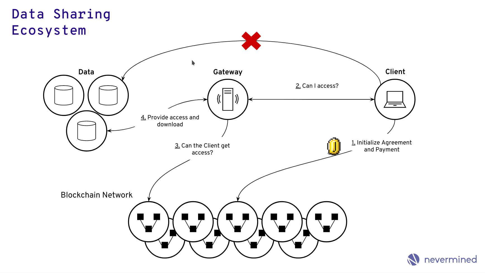
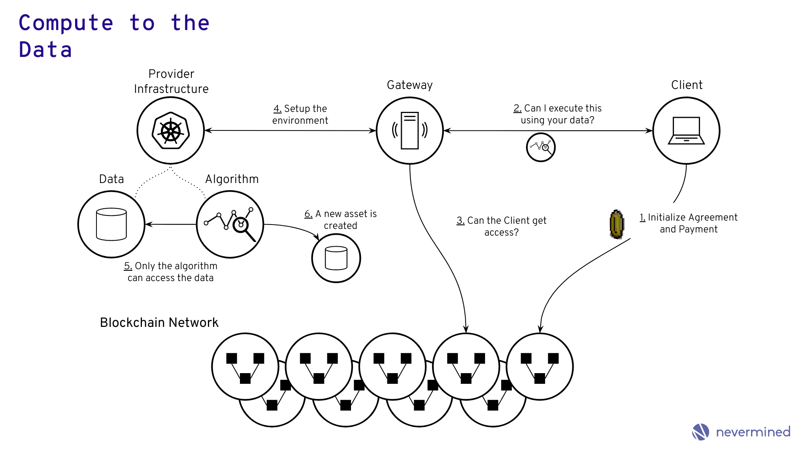
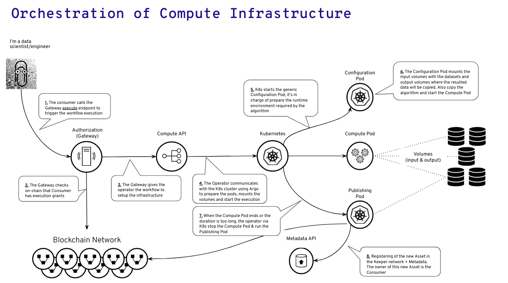

# Nevermined Architecture

Nevermined is based in three core building blocks:

## Data Sharing

It enables the data sharing capabilities between unstructured parties.
The main users involved in this scenario are:

* Organizations with data that need to share and monetize (**Data Owners**).
* Organizations or individuals looking for data sets to train their models
  (**Data Consumers**).

Typically Data Owners & Consumers don't know or trust each other. Nevermined
provides a generic solution where both can share data in a decentralized and
secure way. The main benefits for them are:

* Data Owners can get some benefit of their existing data
* Data Consumers can get access to datasets they couldn't get access in other conditions

In this use case the CONSUMERS can get access to the datasets, so it's ideal for
 problems with low data privacy constraints.

The main capabilities are:

* Allowing data monetization. Data owners can make available their data and get
  some rewards/benefits when others get access to it.
* Allows an easy data publishing or data access from the users.
* Provides a Decentralized Access Control where untrusted members can feel
  confident that other members of the system will play honestly
* Supports free or paid access scenarios
* All the interactions related with the assets or services (when are created in
  the system, who has access, when the access was granted, etc.) is tracked
* The decentralized access control can be used in public or private blockchain
  networks

You can find more details about the technical implementation of the Data Sharing
 use case in the [ACCESS SPEC](architecture/specs/access/README.md).

## Compute to the Data

It facilitates the use cases where data owners allow third parties to execute
some algorithms where the data is.

For the use cases with more privacy restrictions in which the Data Owner never
wants to lose control of their data, and this source data can't be accessed
directly, Nevermined provides a Compute to the Data solution.

This scenario is based on the premise that data doesn't want to be moved.
Moving data of their existing premises is a liability. The data can be leaked in
 transit and because the private nature of the data, moving it implies some
 regulatory issues. In that case, Nevermined provides a solution where the Data
 Owner allows the execution of an algorithm (tensorflow, spark, etc.) in the
 infrastructure where the data is. It means the Data Consumer provides the
 algorithm to execute, and this is moved to the Data Owner infrastructure where
 the data is being kept.

The Data Consumer receives the result of the execution of the algorithm on top
of the data.

You can find more details about the technical implementation of the Compute to the Data use case in the
[COMPUTE SPEC](architecture/specs/compute/README.md).

The main capabilities of the Compute to the Data building block are:

* Solution designed to support different computation or backend paradigms
* Implemented 2 different backends, one of them orchestrating Kubernetes
  containers in the Data Provider environment. Other via the integration of a
  Federated Learning framework
* Framework or programming language independent
* The data never moves, algorithm goes where data is
* Consumer never get access to the real data
* The algorithm is moved where the data is. An ephemeral environment is created
  to support the computation
* It supports the orchestration of computing pipelines
* All the access control and execution is controlled via the integration with
  the service agreements
* Can be run in cloud providers or on-premise
* Permits the monitoring of the workflows execution

### Compute backends

Nevermined supports to plug different compute backends that could be more
convenient depending on the use cases. The rest of the ecosystem keeps the same
(services, api’s, applications on top, etc.), but depending on how the use case
is, Nevermined will orchestrate the compute jobs in different ways. At this
point in time Nevermined integrates 2 different compute backends:

#### Kubernetes backend

This backend is perfect for compute jobs that can be executed in the data
provider data center and don’t have high privacy constraints. In this scenario
the Client can implement the algorithm using different languages or frameworks,
and the Nevermined Compute solution will be in charge of orchestrating the
infrastructure for moving the algorithm where the data is.

As you can see in the above diagram, the Compute API will be in charge of
triggering the compute workflow interacting with the Kubernetes infrastructure
via [Argo](https://argoproj.github.io/). This includes:

* Download the algorithm provided by the Data Scientist/Engineer
* Starts the right Docker container in the infrastructure
* Mount as volume with the data
* Execute the algorithm passing as parameter the path where the data is mounted
* Stop the Compute pod where the algorithm is running
* Publishing the result as a new asset
* Destroy all the ephemeral environment

#### Federated Learning backend

This backend fits for the execution of federated learning jobs using the data of
 providers having federated environments.  In this scenario the Client can
 implement the data training model using a generic federated learning framework,
  and the Nevermined Compute solution will be in charge of orchestrating the
  execution across all the participants.

In this scenario the Compute backend starts two independent tasks, the
coordinator and the aggregator. The coordinator will do all the management of
the participants as part of a federated job. The aggregator will do the secure
aggregation of the trained models. Both the coordinator and aggregator are
ephemeral nodes created by demand, so after the job is executed they will be
stopped till a new execution request is triggered.

## Data Marketplace and Cataloging

It facilitates the search, discovery and management of the existing assets in
the data ecosystem. The main capabilities are:

* Improved User Experience
* Integration with the Data Governance and Data Catalog tools
* Easy search and discovery
* Native integration with the data sharing and compute to the data building blocks
* Internal data catalog and APIs
* Tokenization and incentives
