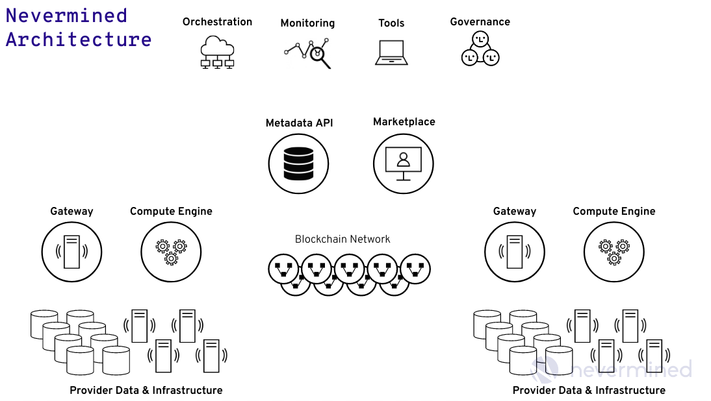

# Nevermined Components

Nevermined is a data ecosystems where different entities can share and monetize
their data and make an efficient and secure usage of it even with untrusted parties.

Nevermined packages, automate and augment multiple independent open and private
software components providing a fully functional data ecosystem adapted to the
requirements of the enterprises.

The complete technical solution includes the following components:

## Architecture of Components

### Smart Contracts

[Nevermined Smart Contracts](https://github.com/keyko-io/nevermined-contracts/)
provide the core of the Data Ecosystem. Using an Ethereum network and
implemented in Solidity, the Smart Contracts provide the following
functionality:

- ERC20 Token - Utility token used within the platform allowing to build all the
  payment mechanisms used across the system.
- DID Registry - Nevermined uses W3C Decentralized Identifiers (DID) to identify
  and register assets in the platform.
  The DID Registry allows the registering and resolving capabilities of assets
  across multiple Metadata providers.
- Service Execution Agreements (SEAs) - The core engine of the platform. They
  allow to define on-chain condition pipelines enabling to the users to define
  complex use cases. The SEAs orchestrate the execution of the Data Access and
  Data Computation use cases of Nevermined.
- Conditions - Small modules that can be plugged into the SEAs allowing to add
  validations logic
- Contract Templates - Pre-defined contract templates implementing some basic
  use cases
- Dispenser - Contract that allows to dispense token under request
- Libraries - Utility libraries used across the contracts

All the previous contracts are Open Source software and provide the core of the
Nevermined network.

In addition to those, Nevermined provides some extensions of the contracts with
extended functionalities:

- Group and individual whitelisting conditions - Enterprise users typically
  manage their corporate identity using Active Directory solutions or similar.
  In those platforms exist the mapping between the user identity and the groups
  where those users are part of. The advanced whitelisting conditions allow to
  map complex identity systems with the Smart Contracts logic allowing to
  provide access control mechanisms on-chain.
- Interface for external Tokens - It allows to plug in the system an external
  ERC20 Token avoiding to use the Nevermined ERC20 token.
- Additional SEAs Templates - The additional Service Execution Templates provide
  a richer set of use cases to be used in the platform.
- Improved SEA - Allowing to have faster agreements and simpler negotiations

#### Smart Contracts Governance

The control of the Smart Contracts (deployment, upgrade) is typically a
responsibility of the Governance committee of the Data Ecosystem.
The team responsible for the definition, deployment and maintenance of the whole
 system.

 A typical user of the ecosystem doesn’t need to know anything about the
 underlying Smart Contracts or Blockchain. All the business logic is
 encapsulated in the client libraries so typically there is no direct
 integration between the users and the Smart Contracts.  

### Metadata API

The [Nevermined Metadata API](https://github.com/keyko-io/nevermined-metadata)
is an Open Source micro-service that allows to store Assets metadata in an
off-chain repository. It provides a plugins system allowing to persist the
Metadata in ElasticSearch or MongoDB. The Metadata API exposes the functionality
 for searching metadata using multiple filters and parameters.

The Metadata API is typically the backend used for Data Marketplaces or Data
Catalogs for storing all the Metadata of a specific domain related to a
Marketplace or Catalog .

Nevermined provides the package and automation of the micro-service allowing an
easy integration and deployment in cloud providers and Kubernetes clusters.

### Gateway

The [Nevermined Gateway](https://github.com/keyko-io/nevermined-gateway) is an
Open Source micro-service in the Nevermined ecosystem. The Gateway is the
technical component executed by Data/Compute Providers allowing them to provide
extended data services (e.g. storage and compute). The Nevermined Gateway, as
part of the Publisher ecosystem, includes the credentials to interact with the
infrastructure (initially cloud, but could be on-premise).

The Gateway allows also the encryption and decryption of components using the following mechanisms:

* RSA
* ECDSA
* Parity Secret Store

Nevermined provides the package and automation of the micro-service allowing an
easy integration and deployment in cloud providers and Kubernetes clusters.

### Compute API

The [Nevermined Compute API](https://github.com/keyko-io/nevermined-compute-api)
 is an Open Source micro-service in the Nevermined ecosystem. It’s a component
 in charge of orchestrating the execution of compute jobs in the premises of
 the Data/Compute Providers.

 In Nevermined the Data/Compute Providers can publish services saying they offer
  compute capabilities to the network on top of their data under some conditions
   for a given price. The Compute API is in charge of, after all the
   verifications made by the Gateway, to manage all the infrastructure to move
   the algorithm where the data is and track the execution of these ephemeral
   environments.

The Compute API is a generic service exposing a REST API that can plugs
different compute backends. At this point in time the Compute API integrates
2 different backends:

* **Kubernetes backend** - It allows the orchestration of Kubernetes clusters
for setting up compute workflows in cloud or on-premise environments.  
* **Federated Learning backend** - It manages the execution of FL jobs in
different federated environments. It starts the coordinator and an aggregator
tasks doing the management of the participants as part of a federated job and
the secure aggregation of the trained models.

Nevermined provides the package and automation of the micro-service allowing an easy integration and deployment in cloud providers and Kubernetes clusters.

### Software Development Kits (SDK's)

SDK's are the software libraries encapsulating the Nevermined business logic. They are used to interact with all the
components & APIs of the system.
Nevermined provides 3 different Open Source implementation of SDK's allowing the integration and implementation of
complex use cases on top of the Nevermined Data Ecosystems.

- [Nevermined SDK JS](https://github.com/keyko-io/nevermined-sdk-js) - JavaScript version of the Nevermined SDK to be
  integrated with front-end applications.
- [Nevermined SDK PY](https://github.com/keyko-io/nevermined-sdk-py) - Python version of the Nevermined SDK to be
  integrated with back-end applications. The primary users are data scientists.
- [Nevermined SDK JAVA](https://github.com/keyko-io/nevermined-sdk-java) - Java version of the Nevermined SDK to be
  integrated with [JVM](https://en.wikipedia.org/wiki/Java_virtual_machine) applications. The primary users are
  data engineers.

The libraries are packaged and delivered in the typical formats for each language allowing easy integration:

- [NPM Nevermined SDK JS](https://www.npmjs.com/package/@keyko-io/nevermined-sdk-js)
- [NPM Nevermined SDK PY](https://pypi.org/project/nevermined-sdk-py/)
- [NPM Nevermined SDK JAVA](https://search.maven.org/artifact/io.keyko.nevermind/api)

### Secret Store

Nevermined integrates the Parity Secret Store to support use cases with high
security requirements for the secret management. These secrets are being used
for the encryption and distributed decryption of the access information to user
assets.

[Parity Secret Store](https://wiki.parity.io/Secret-Store) is a feature included
 as part of the Parity Ethereum client that allows users to store a fragmented
 ECDSA key on the blockchain, such that retrievals are controlled by a
 permissioned Smart Contract.

The Secret Store implements a threshold retrieval system, so individual Secret
Store nodes are unable to reconstruct the keys to decrypt documents by
themselves.
A Secret Store node only saves a portion of the ECDSA key. The decryption key
can only be generated if a consensus is reached by an amount of Secret Store
nodes bigger than the threshold that the publisher of the secret chooses.

The Secret Store is integrated into Nevermined as an optional component for
supporting the encryption and decryption.

### Command Line Interface (CLI) tool

The [Nevermined CLI](https://github.com/keyko-io/nevermined-cli) tool enables to connect to the Nevermined Data Ecosystem
and interact with it using the command line interface. It orchestrates all the underlaying components allowing to:

- Publish assets
- Get access to assets
- Search and discovery
- Running remote compute jobs
- Checking the state of Service Agreements

## Operational

Are the Nevermined tools (not Open Source) allowing to automate, integrate and
operate the rest of the components of the stack. The main tools available are:

### Contract Tools

[Nevermined Contract Tools](https://github.com/keyko-io/nevermined-contract-tools).
The Nevermined Zeppelin OS contract management framework. Deploying and
upgrading Smart Contracts in multiple environments is not an easy thing.

The Nevermined Contract Tools allow to deploy and upgrade smart contracts across
 multiple networks (production or testnet, public or private) mitigating the
 risk loose the control of the Smart Contracts or leave them in a non-functional
  way.

### Development and Integration

The [Nevermined Tools](https://github.com/keyko-io/nevermined-tools) allows to
execute all the components included in the stack in a local environment.
Nevermined Tools make use of all the containers of the components and
orchestrate the execution of them having a fully functional solution using the
same software that you can find in a production environment.

This approach allows to:

- Develop and integrate functionalities with a lower risk of issues when you
  move to a staging or production environment
- Automate the integration tests in the CI environments having fully functional
  networks used for testing
- Connect to remote blockchain networks from your local environment

#### Multisig Wallet

[Nevermined Multisig Wallet](https://github.com/keyko-io/nevermined-multisigwallet)
helps during the token governance process. The purpose of multisig wallets is to
 increase security by requiring multiple parties to agree on transactions before
  execution. Transactions can be executed only when confirmed by a predefined
  number of owners.

### Monitoring

The Nevermined Monitoring component is an integration of the Keyko Web3
Monitoring component adapted to the Nevermined use cases. It allows to monitor:

* The execution of the Service Agreements
* Assets registered
* Token Payments
* Compute use cases
* Blocks, Events and Transactions of the network

The monitoring tool exposes the dashboards for an easy understanding of what's
going on in the network.
