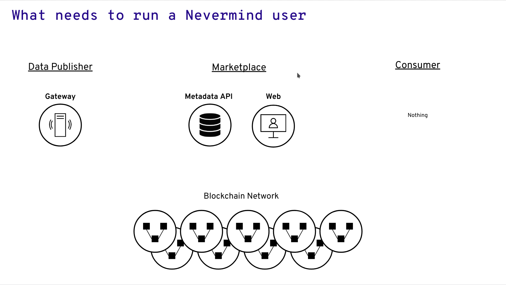
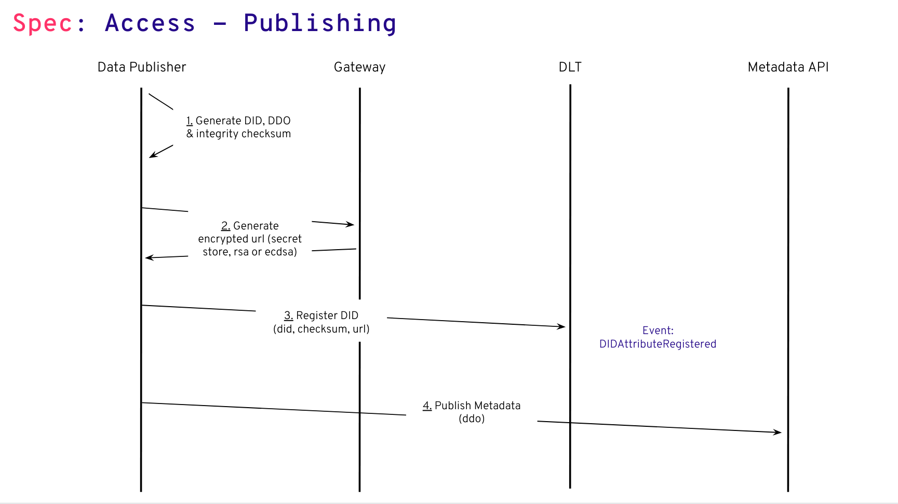
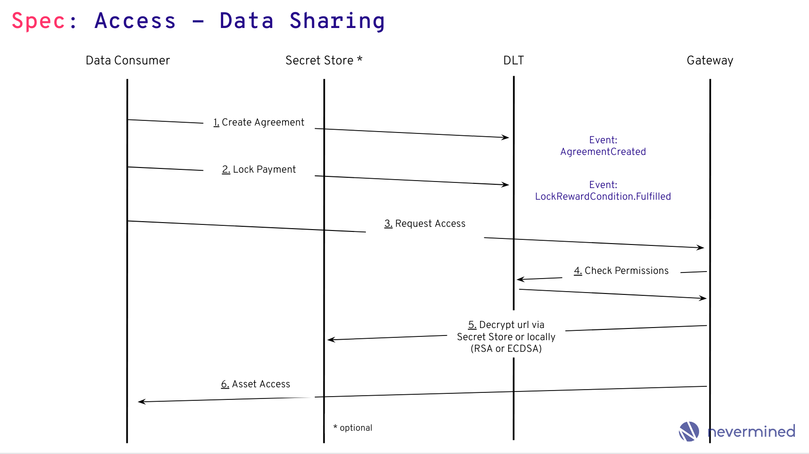

# ACCESS SPEC: Decentralized Access Control

```
shortname:      ACCESS
name:           Decentralized Access Control
type:           Standard
status:         Valid
version:        0.1
editor:         Aitor Argomaniz <aitor@nevermined.io>
contributors:   
```

   * [ACCESS SPEC: Decentralized Access Control](#access-spec-decentralized-access-control)
      * [Motivation](#motivation)
      * [Actors and Technical Components](#actors-and-technical-components)
      * [Flows](#flows)
         * [Publishing Assets](#publishing-assets)
            * [Constructing an Asset DDO](#constructing-an-asset-ddo)
         * [Service Agreement Templates](#service-agreement-templates)
      * [Consuming](#consuming)
         * [Execution of the SEA](#execution-of-the-sea)
            * [Lock Payment Condition](#lock-payment-condition)
            * [Grant Access Condition](#grant-access-condition)
            * [Release Payment Condition](#release-payment-condition)
      * [Consuming the Data](#consuming-the-data)
         * [Consuming without direct integration of Secret Store](#consuming-without-direct-integration-of-secret-store)
         * [Abort Conditions](#abort-conditions)
      * [Encryption and Decryption](#encryption-and-decryption)
         * [Encryption Process](#encryption-process)
         * [Authorization Types](#authorization-types)
            * [Using Secret Store](#using-secret-store)
            * [Using the Data Gateway](#using-the-data-gateway)
               * [PSK ECDSA](#psk-ecdsa)
               * [PSK RSA](#psk-rsa)


---

This SPEC introduces an integration pattern for the use of **Service Execution Agreements (SEAs)** (also called
"Service Agreements" or "Agreements") as contracts between parties interacting in a transaction.
This SPEC uses the SEAs as the core element to orchestrate the publish/consume transactions for multiple services.

## Motivation

The main motivations of this SPEC are:

* Understand how in an environment where different actors don't trust each other, a decentralized access control can
work
* Detail the interaction between parties allowing to grant access to assets in a decentralized manner
* Identify the API methods exposed via the different libraries

## Actors and Technical Components

* PUBLISHERS - Provide access to assets and/or services
* CONSUMERS - Want to get access to assets and/or services
* MARKETPLACES - Store the DDO (including metadata) associated with the assets and/or services

Note: Below, we write "assets" to mean "assets and/or services."

The following technical components are involved with the publishing flow or the consumption flow:

* **MARKETPLACE** - Exposes a web interface allowing users to publish and purchase assets.
  It also facilitates the discovery of assets.
* **SDK** - Software library encapsulating the Nevermined business logic. It's used to interact with all the
  components & APIs of the system. It's currently implemented in the following packages:
  - [nevermined-sdk-js](https://github.com/nevermined-io/sdk-js) - JavaScript version of the Nevermined SDK to be
    integrated with front-end applications.
  - [nevermined-sdk-py](https://github.com/nevermined-io/sdk-py) - Python version of the Nevermined SDK to be
    integrated with back-end applications. The primary users are data scientists.
  - [nevermined-sdk-java](https://github.com/nevermined-io/sdk-java) - Java version of the Nevermined SDK to be
    integrated with [JVM](https://en.wikipedia.org/wiki/Java_virtual_machine) applications. The primary users are
    data engineers.
* [SMART CONTRACTS](https://github.com/nevermined-io/contracts) - Solidity Smart Contracts providing the Service
  Agreements business logic.
* [SECRET STORE](https://wiki.parity.io/Secret-Store) - Included as part of the Parity Ethereum client.
  Allows the PUBLISHER to encrypt the asset URL. Integrates with the SA to authorize (on-chain) the decryption of the
  asset URL by the CONSUMER.
* [GATEWAY](https://github.com/nevermined-io/gateway) - Microservice to be executed by PUBLISHERS. It exposes an
  HTTP REST API permitting access to PUBLISHER assets or additional services such as computation.
* [METADATA-API](https://github.com/nevermined-io/metadata-api) - Microservice to be executed by MARKETPLACES.
  Facilitates   creating, updating, deleting and searching the asset metadata registered by the PUBLISHERS.
  This metadata is included as part of a DDO (see [DID SPEC](../did/README.md) and
  [METADATA SPEC](../metadata/README.md)) and also includes the services associated with the asset (consumption,
  computation, etc.).



## Flows

This section describes the asset publishing flow and the asset consuming flow in detail. It should be straightforward to
 implement those flows by reading it, although the actual implementation may deviate slightly.
The detailed description is an attempt to account for important edge cases and to create a good reference for the
authors of particular implementations.

The intention of the Access flow is to be as lean as possible, allowing data sharing solution with low friction.
In the below image you can see a high level view of the Nevermined Data Sharing flow:


The following parameters are used:

* **did** - Decentralized Identifier (DID). See [DID SPEC](../did/README.md).
* **agreementId** or **serviceAgreementId** - The unique ID referring to a Service Agreement established between a
  PUBLISHER and a CONSUMER. The CONSUMER (via SDK) is the one creating this unique ID.
* **serviceDefinitionId** - Identifies one service in the array of services included in the DDO. It is created by the
  PUBLISHER (via SDK) upon DDO creation.
* **templateId** - Identifies a unique Service Agreement template.


### Publishing Assets

When a PUBLISHER uses the Nevermined SDK to publish (register) an asset, here is a summary of what the SDK does:

1. Construct a new DDO (JSON object describing the asset).
1. Calculate the checksum of all the services (access, provenance, etc) included as part of the DDO
1. Calculates an unique DID
1. Register using the Smart Contracts the DID, checksum of the DDO and the URL pointing to the METADATA API resolving
   the DDO
1. Store the DDO off-chain in the METADATA API

Those steps are explained in more detail below.

The PUBLISHER is able to publish (register) an asset by making a single SDK call.

where `metadata` is a dict containing the [METADATA SPEC](../metadata/README.md) metadata about the asset.

We now expand on the publishing (registration) steps in more detail.

#### Constructing an Asset DDO

An asset DDO is a [DID Document](https://w3c-ccg.github.io/did-spec/#did-documents) conforming with
[the Decentralized Identifiers (DIDs) spec](https://w3c-ccg.github.io/did-spec/).

1. Validate the metadata to ensure that it conforms with [METADATA SPEC](../metadata/README.md).
   (It should be in "local metadata" form at this point.)
1. Compute a DID following [DID SPEC](../did/README.md).
1. Create an empty DDO and add the following things to it:
   * DID
   * Public key of the PUBLISHER
   * Authentication section (with RSA public key)
1. Encrypt the URLs in the `attributes.main.files` array of the metadata.
   The PUBLISHER must specify which encryption service/procedure/plugin they wish to use.
   That encryption service gets recorded in the asset DDO.
   For details, see the section about [Encryption and Decryption](#encryption-and-decryption) below.
   Note: This step changes the metadata and also the `"service"` section of the DDO.
1. Sign the checksum using the `publisher_account` (i.e. compute a signature) and add the computed signature to the
   `proof` attribute.
1. Add the rest of the services to the DDO.
   Each service in the list contains certain information depending on its type. Here we document two types of services
   required for purchasing and consuming an asset.

   A service of type "Access" contains:

   * Service Definition ID (`serviceDefinitionId`); this helps PUBLISHER find the service definition of a DDO signed by
     CONSUMER
   * Service Agreement Template ID (`templateId`); points to an unique instance of a template of a Service Agreement
   * Service endpoint (`serviceEndpoint`); CONSUMERS signing this service send their signatures to this endpoint
   * A list of condition keys; condition key is the `keccak256` hash of the following:
     - SLA template ID
     - controller contract address (obtained from the solidity contract json file matching the contract name in the SLA
       condition)
     - controller contract function fingerprint (referred to as function signature or selector)

   * For each condition, a list is required of its parameter values, a timeout, a set of fields determining what
     conditions depend on other conditions, and a mapping of events emitted by the condition to the off-chain handlers
     of these events
   * Each event is identified by name. Each event handler is a function from a whitelisted module
   * Service Agreement contract address and the event mapping in the same format as the condition events, for off-chain
     listeners
   * An integer defining when the agreement is fulfilled in case there are multiple terminal conditions, according to
     the Service Agreement smart contract

   A service of type "Access" contains 2 different endpoints:

   * **serviceEndpoint** - A URL to initialize the Service Agreement
   * **consumeEndpoint** - A URL to fetch data decryption keys from

    An example of a complete DDO can be found [here](/tree/master/architecture/specs/examples/ddo-example.json). Please do note that the condition's order in the DID document should reflect the same order in on-chain service agreement.

1. PUBLISHER registers the DID, associating the asset DID to the METADATA API link that resolves the DID to a DDO.
To do that, the SDK needs to integrate the `DIDRegistry` contract using the `registerAttribute` method.

```javascript
function registerAttribute (
    bytes32 _did,
    bytes32 _checksum,
    address[] memory _providers,
    string memory _value
)
```

The parameters to pass are:

  * **bytes32 _did** - The hash part of the DID, the part just after `did:nv:`
  * **bytes32 _checksum** - The checksum generated after [compute the DID](../did/README.md#how-to-compute-a-did)
  * **address[] _providers** - The list of providers which PUBLISHER delegates URL decryption capabilities and SEA management
  * **string _value** - The Metadata service endpoint. In the above DDO its: http://metadata.org/api/v1/metadata/assets/ddo/{did}



1. The SMART CONTRACT will emit the `DIDAttributeRegistered` including the `did`, `checksum` and `url` registered.

### Service Agreement Templates

It represents a standard template of a Service Agreement between parties. A template includes standard conditions
allowing to be used by Nevermined users as reference during the negotiation between parties to establish a formal
agreement on-chain.

A Service Agreement Template includes:

    * A template identifier: `templateId`
    * A list of Conditions
    * Timeouts

To facilitate the creation of agreements between parties, the templates provide standard agreements ready to be used
during the creation of Service Agreement instances between parties. Interaction with templates can be done via the
`TemplateStoreManager` contract.

For the Data Sharing use case, Nevermined provides the EscrowAccessSecretStore template.

1. The EscrowAccessSecretStore Service Agreement template has the following shape:

```javascript
const agreement = {
    id: id,
    did: did,
    templateId: templateId,
    conditionIds: [
        conditionIdAccess,
        conditionIdLock,
        conditionIdEscrow
    ],
    timeLocks: [timeLockAccess, 0, 0],
    timeOuts: [timeOutAccess, 0, 0],
    actors: [actors]
}
```

1. For the different conditionIds, the CONSUMER needs to generate those and add them to the agreement to be defined on-chain.
   This requires to generate the hash including the **agreementId** and all the values of the specific condition:

```javascript
const conditionIdAccess = await accessCondition.generateId(agreementId, await accessCondition.hashValues(did, receiver))
const conditionIdLock = await lockPaymentConditon.generateId(agreementId, await lockPaymentConditon.hashValues(escrowPayment.address, escrowAmount))
const conditionIdEscrow = await escrowPayment.generateId(agreementId, await escrowPayment.hashValues(escrowAmount, receiver, sender, conditionIdLock, conditionIdAccess))
```

1. PUBLISHER publishes the DDO in the METADATA API.

## Consuming

Using SDK calls, a CONSUMER can discover, purchase and get access to assets.

Steps for leveraging SDK:

1. The CONSUMER uses the search method to find relevant assets related with his query. It returns a list of DDO's.
   `assets = nevermined.assets.search("weather Germany 2019")`

1. The CONSUMER chooses a service inside a DDO (the CONSUMER selects a `serviceDefinitionId`).

1. The Service Agreement needs to have an associated unique `serviceAgreementId` that can be generated/provided by the
   CONSUMER. In the Smart Contracts, this `serviceAgreementId` will be stored as a `bytes32`. This `serviceAgreementId`
   is generated randomly and is represented by a 64-character hex string (using the characters 0-9 and a-f).
   The CONSUMER can generate the `serviceAgreementId` using any kind of implementation providing enough randomness to
   generate this ID (64-characters hex string).

1. The CONSUMER signs the service details. The signature contains `(templateId, valuesHashList, timeoutValues, agreementId)`.
   The `agreementId` is provided by the CONSUMER and has to be globally unique.
   * Each ith item in `values_hash_list` lists corresponds to the ith condition in conditions list
   * `values_hash_list`: a hash of the parameters types and values of each condition

This signature is used to correlate events and to prevent the PUBLISHER from instantiating multiple Service Agreements from a single request.


1. The CONSUMER sends `(did, serviceAgreementId, serviceDefinitionId, signature, consumerAddress`) to the service endpoint (GATEWAY).
`serviceDefinitionId` tells the PUBLISHER where to find the preimage to verify the signature. The DID tells the PUBLISHER which asset to serve under these terms.

```
HTTP POST /api/v1/GATEWAY/services/access/initialize

{
 "did": "did:nv:08a429b8529856d59867503f8056903a680935a76950bb9649785cc97869a43d",
 "serviceAgreementId": "bb23s87856d59867503f80a690357406857698570b964ac8dcc9d86da4ada010",
 "index": 0,
 "signature": "cade376598342cdae231321a0097876aeda656a567a67c6767fd8710129a9dc1",
 "consumerAddress": "0x00a329c0648769A73afAc7F9381E08FB43dBEA72"
}
```

The execution of this endpoint should return a `HTTP 201` if everything goes okay. Satisfactory conditions include:

   - When GATEWAY receives a signature from the service endpoint and verifies the signature.

   - Having the `did`, GATEWAY fetches the DDO related with this `did`.

   - GATEWAY records the `serviceAgreementId` as corresponding to the given `did`.

   - GATEWAY executes the Service Agreement by calling `EscrowAccessSecretStoreTemplate.createAgreement`, providing it with the agreementId and all the agreement values

   - GATEWAY starts listening for the `publisher` events from the events section of the service definition.

1. After receiving the HTTP response confirmation from GATEWAY, the CONSUMER starts listening for the `AgreementCreated` events specified in the corresponding service definition, filtering them by `agreementId`.

### Execution of the SEA

Consider an asset purchase example. CONSUMER locks the payment. Then PUBLISHER grants access to the document. Then payment is released. Now CONSUMER may decrypt the document.

In general, there is a broad range of conditions which can be implemented and integrated into the described workflow.

#### Lock Payment Condition

Consider a sample of a service definition.

```
"serviceAgreementTemplate": {
		"contractName": "EscrowAccessSecretStoreTemplate",
		"events": [{
			"name": "AgreementCreated",
			"actorType": "consumer",
			"handler": {
				"moduleName": "escrowAccessSecretStoreTemplate",
				"functionName": "fulfillLockPaymentCondition",
				"version": "0.1"
			}
		}]
  }
```

According to this sample, the CONSUMER listens for the `AgreementCreated` event emitted in the very beginning of
Service Agreement execution, filtering it by `agreementId`.

Note that the structure of `serviceAgreementContract.events` is identical to `conditions.events`. SDK needs to offer a
utility that subscribes the specified callbacks to the events from both lists.

When the CONSUMER receives this event it means the agreement is in place and can perform the lock reward:

```
await token.approve(lockPaymentConditon.address, escrowAmount, { from: sender })
await lockPaymentConditon.fulfill(agreementId, escrowPayment.address, escrowAmount)
```

If everything goes right, it will emit `LockPaymentCondition.Fulfilled` and thus will trigger the next condition.

#### Grant Access Condition

PUBLISHER (via GATEWAY) listens for `LockPaymentCondition.Fulfilled` event filtered by `agreementId` to confirm the reward was locked by the CONSUMER.

```
"conditions": [{
  "events": [{
        "name": "Fulfilled",
        "actorType": "publisher",
        "handler": {
            "moduleName": "lockPaymentConditon",
            "functionName": "fulfillAccessCondition",
            "version": "0.1"
        }
    }]
}]
```

In this case the PUBLISHER can grant access to the CONSUMER for a specific `agreementId` and `documentId` using in this case the `AccessCondition.fulfill`:

```
await accessCondition.fulfill(agreementId, agreement.did, receiver)
```

If everything goes right, the Smart Contract will emit the `AccessCondition.Fulfilled` event.

#### Release Payment Condition

PUBLISHER (via GATEWAY) listens for `AccessCondition.Fulfilled` event to transfer tokens to PUBLISHER's account.

```
"conditions": [{
    "events": [{
        "name": "Fulfilled",
        "actorType": "publisher",
        "handler": {
            "moduleName": "access",
            "functionName": "fulfillEscrowPaymentCondition",
            "version": "0.1"
        }
    }]
}]
```

So when the PUBLISHER receives the `AccessCondition.Fulfilled` he can call the `EscrowPayment.fulfill` method to receive the reward:

```
await escrowPayment.fulfill(agreementId, escrowAmount, receiver, sender, agreement.conditionIds[1], agreement.conditionIds[0])
```

## Consuming the Data

CONSUMER (via SDK) listens for `AccessCondition.Fulfilled` event to access the document.

```
"conditions": [{
    "events": [{{
        "name": "TimedOut",
        "actorType": "consumer",
        "handler": {
            "moduleName": "access",
            "functionName": "fulfillEscrowPaymentCondition",
            "version": "0.1"
        }
    }]
}]
```

The following are steps that have to be performed by the CONSUMER to receive the data.

1. CONSUMER decrypts the URL using the SDK. This only requires the encryptedUrl existing in the DDO and the DID.
   A Parity EVM client (local or remote) and SECRET STORE cluster can be used for that.

1. CONSUMER retrieves data by calling the dedicated GATEWAY endpoint (`serviceEndpoint` in the service definition)
providing it with Consumer ethereum address, service agreement ID, and decrypted URL.

The consume URL may look like:

```
HTTP GET /api/v1/GATEWAY/services/access/consume?consumerAddress=${consumerAddress}&serviceAgreementId={serviceAgreementId}&url={url}`
```

This method will return a HTTP 200 status code if everything was okay and the data file.

When CONSUMER requests purchased data, GATEWAY gets 3 parameters:

* Consumer ethereum address: `consumerAddress`
* Service Agreement ID: `serviceAgreementId`
* Decrypted URL: `url`. This URL is only valid if GATEWAY acts as a gateway. CONSUMER cannot download using the URL if it's not done through GATEWAY.

Using those parameters, GATEWAY does the following things:

* Find the `did` by the given `serviceAgreementId`

* Verify the given service is allowed to be consumed by the given `consumerAddress` and `did` using the `checkPermissions` method of the `SLA` Smart Contract.

* If CONSUMER has permissions to consume, download and provide data for the given DID



### Consuming without direct integration of Secret Store

If the CONSUMER (via SDK) can't integrate directly SECRET STORE for decryption (nevermined-sdk-js using Metamask can't
provide the account password), it's possible to call GATEWAY with an alternative `consume` method.

In this scenario, the GATEWAY is in charge of decrypting the content in behalf of the CONSUMER.

The consume URL may look like:

```
HTTP GET /api/v1/gateway/services/access/consume?pubKey=${pubKey}&serviceAgreementId={serviceAgreementId}&signature={signature}&index={index}`
```

This method will return an HTTP 200 status code if everything was okay, plus the URL required to get access to the data.

When CONSUMER requests purchased data, GATEWAY gets 3 parameters:

* Consumer public key: `pubKey`
* Service Agreement ID: `serviceAgreementId`
* Signature: `signature`. The signed `serviceAgreementId` value by the CONSUMER to validate his/her identity
* Index: `index`. Integer value representing the position of the content to download in the `DDO.files` array

### Abort Conditions

Every condition can be fulfilled or aborted using the configured timeout.
For example it would allows to the CONSUMER to cancel the payment after locking it but not receiving access to the asset
 for a long period of time. Mechanisms implemented in the Service Agreement contract ensure there are no race conditions.


## Encryption and Decryption

The PUBLISHER can define how they want to encrypt the URLs included in the `attributes.main.files` array of the metadata.
This information must be added to the DDO to allow CONSUMERs (via SDK) to understand how to deal with the URLs.
Below is an example of how to add an encryption service to the `service` section of a DDO.

```json
"service": [{
    "type": "authorization",
    "index": 0,
    "service": "SecretStore",
    "serviceEndpoint": "http://secretstore.org:12001",
    "config": {
      "threshold": 3
    },
  },
  …
]
```

The encryption service is one object with the following attributes:

* type - Differentiate this kind of service with the word **Authorization**
* index - Existing in all the DDO services to differentiate one entry in the `services` list
* serviceEndpoint (optional) - URL used during the encryption and decryption process.
* attributes.main - List of mandatory attributes specific of the type
  - service - The authorization service type. It could be `SecretStore`, `PSK_ECDSA` or `PSK_RSA`.


The encryption/authorization service is optional. If it's not provided, the usual SECRET STORE cluster defined in the
SDK configuration will be used.

### Encryption Process

Suppose the `attributes.main.files` array in the metadata has three URLs:

```json
"files": [
    {
        "url": "https://example.com/data-file-0.csv",
        "index": 0,
        "checksum": "efb2c764274b745f5fc37f97c6b0e761",
        "contentLength": "4535431",
        "resourceId": "access-log2018-02-13-15-17-29-18386C502CAEA932"
    },
    {
        "url": "https://example.com/data-file-1.csv",
        "index": 1,
        "checksum": "085340abffh21495345af97c6b0e761",
        "contentLength": "12324"
    },
    {
        "url": "https://example.com/data-file-2.csv",
        "index": 2
    }
]
```

The `attributes.main.files` array is encrypted as follows.
First it is converted into a string like so:

```json
[{"url":"https://example.com/data-file-0.csv","index":0,…,"index":2}]
```

where all spaces are removed (except inside the string values). Also, all newlines, line feeds, and carriage returns
are removed. That JSON string can then be encrypted.

After encryption, all `"url"` keys and values are removed from the `attributes.main.files` array objects, and a new
`attributes.encryptedFiles` key and value are added to the metadata, e.g.

```json
"encryptedFiles": "0x2e48ceefcca7abb024f90…f3fec0e1c"
```

We now describe the supported encryption procedures.

### Authorization Types

The system supports different implementation for managing the authorization of the encryption/decryption of secrets.
The authorization type can be found in `attributes.main.service` attribute. The authorization mechanisms supported are:

- `SecretStore` - Parity Secret Store
- `PK-ECDSA` - ECDSA Pre-Shared Keys
- `PK-RSA` - RSA Pre-Shared Keys

#### Using Secret Store

The SECRET STORE cluster to use during the encryption and decryption is specified in the **serviceEndpoint** attribute, e.g.

```json
"service": [{
    "type": "authorization",
    "index": 0,
    "attributes": {
      "main": {
        "service": "SecretStore",
        "threshold": "1"
      }
    },
    "serviceEndpoint": "http://secretstore.org:12001"
  },
  …
]
```

More information about the integration of a SECRET STORE can be found
[Parity Secret Store page](https://wiki.parity.io/Secret-Store).

#### Using the Data Gateway

For those clients not able to integrate SECRET STORE directly, GATEWAY will support an encryption endpoint supporting
the following parameters:

```http
HTTP POST /api/v1/gateway/services/encrypt

{
 "id": "did:nv:08a429b8529856d59867503f8056903a680935a76950bb9649785cc97869a43d",
 "document": [
     {
         "url": "234ab87234acbd09543085340abffh21983ddhiiee982143827423421",
         "checksum": "efb2c764274b745f5fc37f97c6b0e761",
         "contentLength": "4535431",
         "resourceId": "access-log2018-02-13-15-17-29-18386C502CAEA932"
      },
      {
          "url": "234ab87234acbd6894237582309543085340abffh21983ddhiiee982143827423421",
          "checksum": "085340abffh21495345af97c6b0e761",
          "contentLength": "12324"
      },
      {
          "url":"80684089027358963495379879a543085340abffh21983ddhiiee982143827abcc2"
      }
  ]
}
```

That is, the value of `document` should be the `attributes.main.files` array.

This endpoint will return the content encrypted using the GATEWAY account.

The GATEWAY will expose the public keys using for encryption in the following endpoint:

```
http://0.0.0.0:8030/
```

In the JSON returned there will be the `*-public-key` entries with the different public keys enabled in the GATEWAY:
```json
{
...
"ecdsa-public-key": "0xaaaaa",
"rsa-public-key": "0xaaaaa",
...
}
```

##### PSK ECDSA

In a DDO definition, can be defined a Pre-Shared ECDSA mechanism using the following configuration:

```json
"service": [{
    "type": "authorization",
    "index": 0,
    "attributes": {
        "main": {
          "service": "PSK-ECDSA",
          "publicKey": "0xaaaa" // ECDSA Public Key of the Gateway
        }
    },
    "serviceEndpoint": "http://mygateway.net/"
  },
  …
]
```

##### PSK RSA

In a DDO definition, can be defined a Pre-Shared RSA mechanism using the following configuration:

```json
"service": [{
    "type": "authorization",
    "index": 0,
    "attributes": {
        "main": {
          "service": "PSK-RSA",
          "publicKey": "0xaaaa" // RSA Public Key of the Gateway
        }
    },
    "serviceEndpoint": "http://mygateway.net/"
  },
  …
]
```
