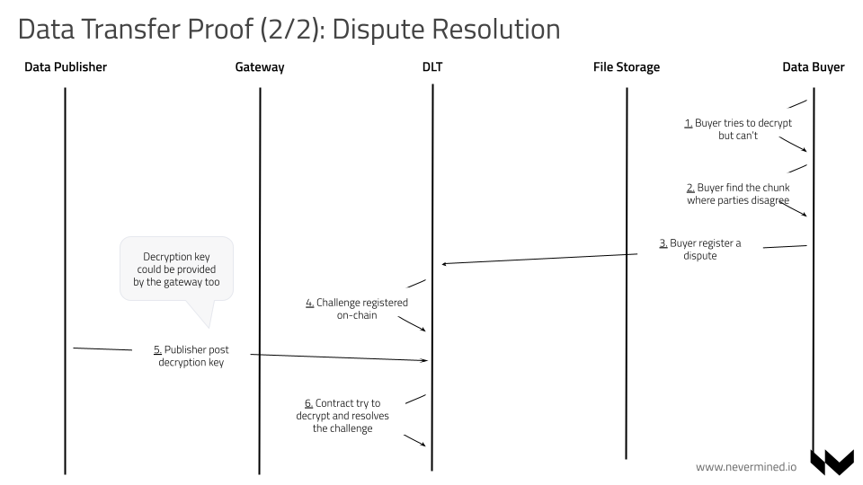
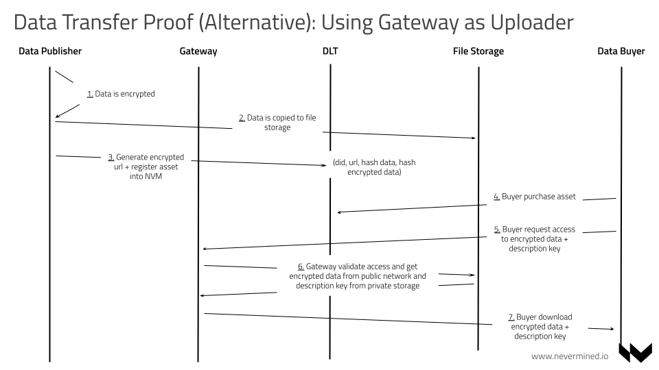

# KETRANSFER SPEC: Data transfer proofs

```text
shortname:      KEYTRANSFER
name:           Data transfer proofs
type:           Standard
status:         Valid
version:        0.1
editor:         Sami Mäkelä <sami@keyko.io>
contributors:   Aitor Argomaniz <aitor@keyko.io>
```

   * [KETRANSFER SPEC: Data transfer proofs](#ketransfer-spec-data-transfer-proofs)
      * [Motivation](#motivation)
         * [Main ideas](#main-ideas)
      * [Actors and Technical Components](#actors-and-technical-components)
      * [Flows](#flows)
         * [Publishing Assets](#publishing-assets)
         * [Service agreement](#service-agreement)
         * [Accessing from gateway](#accessing-from-gateway)

---

This SPEC describes an addition to ACCESS SPEC, namely new flows with improved guarantees about data transfer.
This enables using public storage for encrypted data.

## Motivation

Nevermined manages access control over digital assets. The protocol has been based in authenticate and authorize consumers to get access to components created and registered into an ecosystem by a publisher.
When this access control needs to be implemented on top of storage solutions with some authorization mechanism (like Amazon S3 or similar) it's easier. The gateway protects that only authorized users can get access.
But when you want to use some storage without any access control capabilities (like a file available in a public HTTP url, or in IPFS or Filecoin), whoever with access to the URL can get access to the file going over any access control mechanism that Nevermined can provided.

In this kind of scenarios, they only way to protect this content is to encrypt it, and only allow to decrypt when the user fulfill some conditions. This SPEC is about the defition of the solution that allows to build robust and scalable access control on top of publicly available data.

### Main ideas

If the unencrypted asset is described by its hash, there are at least two use cases for being able to prove that the access to the asset with given hash is transferred:

* A third party might have reviewed the data and can confirm its properties. Additionally it will show that each recipient gets the same data.
* If compute attestation is available, for it to work both participants need access to data.

To save resources, instead of showing that all the data is transferred, we assume that there is publicaly available encrypted data and only the symmetric key will be transferred (the hash of symmetric key is known by all participants). This does not impact the above use cases:

* The third party can instead validate the combination of the key and encrypted data.
* The compute attestation will use the encrypted data hash and the key instead of plain data hash as starting point. Note that with interactive proofs it would be enough for sender to send the decrypted key signed with their ECDSA or similar key. An advantage is that the keys can be used multiple times when using snarks.

## Actors and Technical Components

* PUBLISHERS - Provide access to assets and/or services
* CONSUMERS - Want to get access to assets and/or services
* PROVIDER - When the publisher is not 100% 'online' can delegate some responsibilities to a provider for making data available on behalf of the publisher

## Flows

### Publishing Assets

To set up the asset metadata:

For the files, the first file represents the key and `url` attribute contains the plain text key (probably have to change).
These parts of metadata are encrypted so they won't show up publicly when querying the gateway.

The public parts that have to be added to `additionalInformation` are

* `poseidonHash`: Poseidon hash of the key.
* `providerKey.x` and `providerKey.y`: The Babyjubjub public key of the provider.

### Service agreement

For the service agreement, following data is needed:

* Address of provider and consumer.
* Asset ID.
* Poseidon hash of the data.
* Babyjubjub keys of the provider and consumer.
* Payment information.

Before entering into the agreement, the consumer should already have downloaded the publicly available encrypted data.

Other parts of the flow are the same as normal access flow, but the final fulfilling of the transfer on-chain is different.

Provider first has to compute a shared secret using ECDH from his private key and consumers public key. This secret is used to encrypt the key using MiMC. The encrypted key is then sent onchain with the SNARK proof of correctness.

Similarly, consumer first has to compute a shared secret using ECDH from his private key and providers public key. The encrypted key is read from chain and then decrypted using MiMC. The hash of the result will be the same as was given beforehand.

Here is the complete flow including the different actors:


In the case of an issue, here you can find the flow about how to manage the dispute resolution:



### Accessing from gateway

In this scenario, the gateway acts as a PROVIDER. This is specially useful when the PUBLISHER doesn't want to be on-line running a service for responding to CONSUMER requests.
In these kind of scenarios, the PUBLISHER delegates to the PROVIDER running a gateway the capabilities of releases the decryption key to the CONSUMER when the conditions are fulfilled.

Accessing documents using the gateway mostly works the same way as normal flow, but the consumer has to send its Babyjubjub public key too. The data must be checked so that the gateway won't send invalid proofs to the net (it's possible to get the key from the calldata of the fulfill method if they have the corresponding key).
Additionally we can check that the eth address corresponds to the babyjub public key. This isn't absolutely necessary, but is needed if we want the gateway to return the data transfer key (or perhaps the data as plain text).


