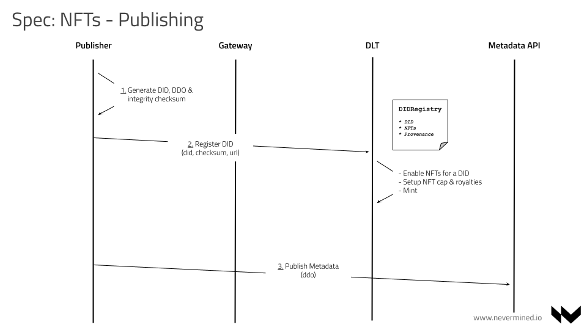

# NFT SPEC: Non Fungible Tokens Engine

```
shortname:      NFT
name:           Non Fungible Tokens Engine
type:           Standard
status:         Draft
version:        0.1
editor:         Aitor Argomaniz <aitor@nevermined.io>
contributors:   
```

* [NFT SPEC: Non Fungible Tokens Engine](#nft-spec-non-fungible-tokens-engine)
   * [Motivation](#motivation)
   * [Use Case](#use-case)
      * [Publisher](#publisher)
      * [Consumer](#consumer)
      * [Facilitator](#facilitator)
   * [Concepts](#concepts)
      * [Building Blocks](#building-blocks)
      * [NFT Specs (via ERC-1155)](#nft-specs-via-erc-1155)
   * [Architecture](#architecture)
      * [NFTs Principles](#nfts-principles)
      * [Implementation](#implementation)
      * [Flows](#flows)
         * [Publishing an Asset tokenized via NFTs](#publishing-an-asset-tokenized-via-nfts)
         * [Purchase and usage of a NFT](#purchase-and-usage-of-a-nft)
      * [Templates](#templates)
         * [Template for selling a tokenized asset via NFTs](#template-for-selling-a-tokenized-asset-via-nfts)
         * [Access to contents holding a NFT](#access-to-contents-holding-a-nft)
         * [Template for selling an Asset](#template-for-selling-an-asset)
      * [Provenance](#provenance)
   * [Links](#links)


---

This SPEC introduces Non Fungible Tokens (NFTs) as part of Nevermined architecture allowing the tokenization of assets, sales with secondary market royalties support and exclusive access to NFT holders.

## Motivation

With this Specification we want to add to Nevermined the technical capabilities allowing the users to have a platform where digital and physical assets can be represented and traded between people openly, but keeping security, integrity, provenance and content creator's attribution.

With that objective in mind, Nevermined must facilitate the execution of use cases like the following:

* Art publishing, exhibition, selling. Secondary market
* Collection of objects
* Tokenization of digital and physical assets (real estate, etc.)
* etc

The intention of this document is to discuss how a fully functional NFT engine can be established in a decentralized system, to allow the support of complex use cases related with assets tokenization.

The main objectives of this SPEC are:

* Understand the main use cases we can to implement
* Understand how assets can be tokenized using NFTs
* Understand how asset and NFTs sales can be established between creators, owners and consumers
* Identify how NFTs rely in some other Nevermined building blocks
* Specify how NFTs associated to assets (DIDs) can be minted and burner
* Allow the definition of royalties that enable the retribution of original creators in the secondary market
* Specify how NFT holders can get access to existing services
* Understand what provenance information needs to be tracked


## Use Case

The following use case helps to understand the scope of the problem driving the technical implementation to put in place.
For this use case we have to take into account the following target users:

* Publishers (an artists for example)
* Consumers (a collector)
* Facilitators (an art gallery for example)

### Publisher

As a **Publisher**:

* I want to register digitally an asset
* I want to associate some metadata information to the assets I register
* I want to show my track record as publisher (bio, what I created, what I sold, etc.)
* I want to sell a digital representation of an asset for some price
* I want to limit the number of copies of an asset for sale
* I want to be rewarded via royalties in the secondary market for further sales
* I want to be able to delegate or loan some of my assets to a **Facilitator** user (gallery, etc.)


### Consumer

As a **Consumer**:

* I want to discover relevant assets filtering by multiple parameters
* I appreciate curated assets avoiding me to waste time searching for high quality
* I want to see a digital representation of an asset and detailed information of it
* I want to check the ownership of an asset and full provenance record
* I want to see how many pieces of an specific assets were created
* I want to purchase an asset or part of an asset series
* I want to see and share my list of purchased assets
* I want to be able the sell any of my purchased assets to others

### Facilitator

As a **Facilitator**:

* I want to explore all the assets existing in a the general market
* I want to invite publishers to expose in my space
* I want to to receive exhibition requests in my space and curate the assets and publishers to list
* I want to negotiate with publishers the conditions (sell commission) for listing in my space
* I want to maximize my sales online
* I want to provide my track record curating, selling, collecting and listing assets


## Concepts

### Building Blocks

Nevermined is based in the following building blocks:

* [Decentralized Identifiers (DID)](../did/README.md) - To identify items across on-chain and off-chain networks
* [Access Control](../access/README.md) - To control who can do what and under what conditions
* [Provenance](../provenance/README.md) - To track all the actions associated with every registered asset
* [Tokenized Payment Gateway](../access/README.md#lock-payment-condition) - To allow direct payment
* [Integrity](../did/README.md#integrity) - To provide proof that everything is correct
* [Identity Management](../id_management/README.md) - To allow to define fine access control policies

On top of all of that, this Specification augments Nevermined with the support of Non Fungible Tokens (NFTs). The main intention of this is to allow the tokenization, transfer, mint and burn of any existing asset published in a Nevermined ecosystem.

In Nevermined, any registered asset is a DID registered via the `DIDRegistry` Smart Contract. This contract provides a generic way to represent the creation of a digital asset in a Nevermined ecosystem. This digital asset can be the representation of anything in the real world, a data set in a big data lake, a vaccine shipment in a supply chain process, an artwork in a virtual (or physical) gallery or anything else. The `DIDRegistry` tracks that registration in an immutable way, associating this digital asset with the creator of that representation in a Nevermined ecosystem.

This Specification assocites directly the standard NFT capabilities to any existing asset registered via the `DIDRegistry`. It allows without friction the possibility of tokenize via NFTs any existing DID.


### NFT Specs (via ERC-1155)

Nowadays the main standard for providing NFTs functionality in Ethereum networks is ERC-721. ERC-721 require a separate contract to be deployed for each token type or collection. This places a lot of redundant bytecode on the Ethereum blockchain and limits certain functionality by the nature of separating each token contract into its own permissioned address. This means high cost, complexity, etc.

Additionaly to ERC-721, ERC-1155 implements a multi-token factory allowing to register and tokenize multiple and independent assets in the same contract instance without multiple deployments. ERC-1155 design permits transferring multiple token types at once, saving on transaction costs.It is also easy to describe and mix multiple fungible or non-fungible token types in a single contract.

Because of these advantages the following NFT integration will be based in the ERC-1155 foundations.

## Architecture

### NFTs Principles

The NFTs engine is based in the following principles:

* Every asset has a Decentralized Identifier (aka DID) attached, and every DID as a identifier representing a digital entity can have associated multiple NFTs, allowing the tokenization of any kind of digital asset independently of the physical asset behind of it
* The user registering a DID can decide if he wants to enable or not the tokenization of the asset via NFTs
* When the tokenization is enabled for a specific asset, the user registering the asset can define a minting cap. This minting cap can not be changed afterward, because modifying the number of existing items of an asset will affect the further value of them for the NFTs holders. If the minting cap is set to zero, it means the DID minting is uncapped.
* The user registering an asset can specify the royalties that are rewarding the original creator in the secondary market. This royalties must be between 0 and 100 percent. The royalties can not be changed after they are initialized. This protects the buyers of a NFT to have to pay for a different commission to the one agreed during the purchase of a NFT.
* The payment and transfer of NFTs must always respect the original creators attribution and rewards
* Users giving or selling NFTs can have a mechanism to facilitate exclusive services to NFT holders


### Implementation

From a Smart Contracts point of view, the `DIDRegistry` now extends a new `NFTUpgradeable` smart contract. This new contract implements the `ERC-1155` standard and it's based in OpenZeppelin implementation.

With this change, when a new Asset is registered via the DIDRegistry, it can automatically `mint`, `burn` and `transfer` NFTs attached to the Asset. Example:

```js

await didRegistry.registerMintableDID(
                did, checksum, [], url, cappedAmount, royalties, constants.activities.GENERATED, '')
await didRegistry.mint(did, 5)
await didRegistry.burn(did, 1)
await didRegistry.balanceOf(someone, did)
```

The `registerMintableDID` is a new method that facilitates a couple new things for users registering assets who want to attach a NFT to them:

* They enable the NFT functionality for the asset registered. By default, the assets registered via the `registerDID` method do not have the NFTs functionality enabled.
* It setups a minting cap for the asset
* It specify the percentage of royalties (between 0 and 100) that the original creator of the Asset wants in the secondary market for a further sale.

When a DID is registered via the traditional `registerDID` method, the same functionality can be obtained calling the `enableAndMintDidNft` method. Example:

```js
await didRegistry.registerAttribute(did, checksum, [], url)
await didRegistry.enableAndMintDidNft(did, 5, 0, true)
```

### Flows

#### Publishing an Asset tokenized via NFTs

The publishing of an asset (with NFTs associated) involves:

* Filling and publishing the asset metadata and price
* The publisher defines the metadata in a DDO object, the number of NFTs to mint, their price and royalties in the secondary market.
* Association of unique Decentralized Identifiers (DID) and register on-chain
* The publisher register on-chain via `DIDRegistry` the new asset id (DID)
* Adding provenance event about content creation
* The Contracts track the provenance event of a new Asset registered
* The publisher initialize the NFT setup associated to the Asset
* Optionally defining the royalties to receive in further sales in the secondary market
* Optionally define the limited items of the serie. NFT minting for a DID can be capped
* The contract mint the NFTs associated to the asset (DID) limited serie
* All the NFTs minted are locked ready to be used in sales




#### Purchase and usage of a NFT

The purchase of a NFT associated to an asset involves:

* The consumer discover an interesting asset with NFTs attached to it (offchain) via marketplace, catalog, gallery, etc.
* The consumer initialize a service agreement on-chain with the intention of purchase a NFT
* The consumer lock the funds required to purchase a NFT. In case the NFT is being sold by a user that is not the original asset creator, the price must include the original creator royalties
* The owner or a provider can trigger the TransferNFTCondition condition to approve the purchase and make the transfer of the NFT
* Anyone can call the new EscrowPayment condition. It will be in charge of:
  - Distribute the rewards to the publisher or seller
  - Distribute the royalties to the original creator (if is not the same than the seller)

Using the existing `NFTHolder` condition it will be possible to the new NFT owner to get access to Nevermined services


### Templates

The Nevermined Service Execution Agreements provide standard scenarios for providing access and trigger remote computation.
To complement those, this Spec detail 3 additional templates to support the following flows:

* NFT Sale. An asset owner tokenized an asset and sell one or many of the NFTs to a different user.
* NFT Access. A NFT holder can get access to exclusive contents for holding that NFT
* DID Sale. An asset owner wants to sell it totally.

#### Template for selling a tokenized asset via NFTs

The NFT Sales template supports an scenario where an Asset owner wants to tokenize an asset and sell pieces of it via NFTs. Owners buying a new NFT can sell them later to others in a secondary market.

Anyone (consumer/provider/publisher) can use this template in order to setup an agreement allowing a NFT owner to transfer the asset ownership after some payment.

The template is a composite of 3 basic conditions:
- Lock Payment Condition
- Transfer NFT Condition
- Escrow Reward Condition

This scenario takes into account royalties for original creators in the secondary market.
Once the agreement is created, the consumer after payment can request the transfer of the NFT from the current owner for a specific DID.

The DID Sales template is provided by the `NFTSalesTemplate` Smart Contract.


#### Access to contents holding a NFT

The NFT Access template is a use case specific template that allows a NFT owner to get access to exclusive contents provided by the original asset creator associated to the NFT.
Anyone (consumer/provider/publisher) can use this template in order to setup an agreement allowing NFT holders to get access to Nevermined services. The template is a composite of 2 basic conditions:
- NFT Holding Condition
- Access Condition

Once the agreement is created, the consumer can demonstrate he is holding a NFT for a specific DID. If that's the case the Access condition can be fulfilled by the asset owner or provider and all the agreement is fulfilled.
This can be used in scenarios where a data or services owner, can allow  users to get access to exclusive services only when they demonstrate they are holding a specific number of NFTs of a DID.

The DID Sales template is provided by the `NFTAccessTemplate` Smart Contract.


#### Template for selling an Asset

It supports a scenario where an Asset owner can sell that asset to a new Owner.
It is important to say the ownership of the asset is transfered to a new owner but there is always a reference on-chain about the original creator of the asset. This **original creator can't be changed** and is used to reward later to this user in the secondary market.

Anyone (consumer/provider/publisher) can use this template in order to setup an agreement allowing an Asset owner to transfer the asset ownership after some payment.
The template is a composite of 3 basic conditions:
- Lock Payment Condition
- Transfer DID Condition
- Escrow Reward Condition

This scenario takes into account royalties for original creators in the secondary market. Once the agreement is created, the consumer after payment can request the ownership transfer of an asset from the current owner for a specific DID.

The DID Sales template is provided by the `DIDSalesTemplate` Smart Contract.


* DID Sale. An asset owner can put this asset for sale for a price. This not only gives access to the asset, also transfer ownership to the buyer. Further sales reward the creator in the secondary market.
* NFT Sale. An asset owner tokenize an asset using NFTs and sell them to others for a price. Further sales reward the creator in the secondary market.
* NFT access. An asset owner can mint, sell and transfer NFTs associated to a DID. Further NFT holders can get access to contents showing the NFT they hold.

### Provenance

All the actions associated with the usual tokenization flow provided by NFTs register on-chain the relevant provenance entries allowing to track all that happened related to an asset.

1. When a new asset is created it registers the provenance entry `wasGeneratedBy`
1. When the asset owner initialize the asset tokenization via NFTs it raise the `used` provenance entry
1. When the asset owner mint a NFT associated to an asset it raise the `used` provenance entry
1. When the asset owner burn a NFT associated to an asset it raise the `used` provenance entry

## Links

* [The Multi Token Standard](https://enjin.io/about/erc-1155)
* [OpenZeppelin ERC1155 Smart Contract implementation](https://docs.openzeppelin.com/contracts/3.x/erc1155)
