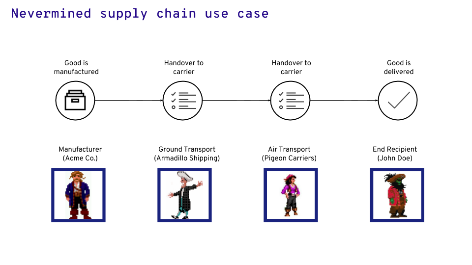
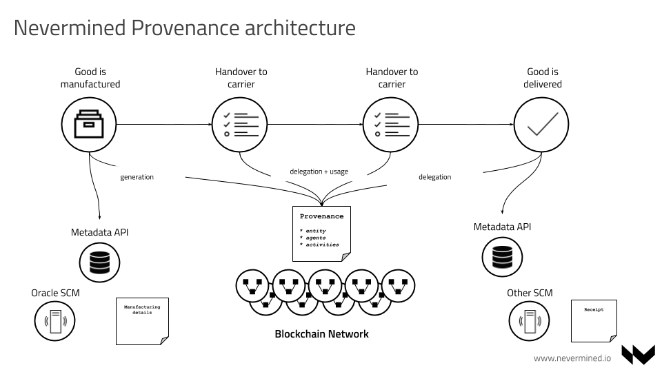

# PROV SPEC: Decentralized Data Provenance

```
shortname:      PROV
name:           Decentralized Data Provenance
type:           Standard
status:         Valid
version:        0.2
editor:         Aitor Argomaniz <aitor@nevermined.io>
contributors:   
```

  * [PROV SPEC: Decentralized Data Provenance](#prov-spec-decentralized-data-provenance)
    * [Motivation](#motivation)
    * [Concepts](#concepts)
       * [Specifications](#specifications)
       * [Provenance Model](#provenance-model)
          * [Provenance Types](#provenance-types)
             * [Entities](#entities)
             * [Agents](#agents)
             * [Activities](#activities)
          * [Provenance Relations](#provenance-relations)
             * [Generation: Register a new entity generated by an agent (wasGeneratedBy)](#generation-register-a-new-entity-generated-by-an-agent-wasgeneratedby)
             * [Derivation: register relationship between source and derived entities (wasDerivedFrom)](#derivation-register-relationship-between-source-and-derived-entities-wasderivedfrom)
          * [Association (wasAssociatedWith)](#association-wasassociatedwith)
          * [Delegation (actedOnBehalfOf)](#delegation-actedonbehalfof)
          * [Usage (used)](#usage-used)
          * [Activity: Register activities](#activity-register-activities)
       * [Examples](#examples)
    * [Scenario](#scenario)
       * [Actors](#actors)
       * [Flow](#flow)
    * [Architecture](#architecture)
       * [Data](#data)
       * [Process](#process)
          * [Good Manufacturing](#good-manufacturing)
          * [Handover to Carrier](#handover-to-carrier)
          * [Handover to the end recipient](#handover-to-the-end-recipient)
       * [Registry](#registry)
          * [Provenance Registry](#provenance-registry)
          * [Metadata Registry](#metadata-registry)
             * [Agents Registry](#agents-registry)
             * [Entities Registry](#entities-registry)
       * [Provenance metadata integrity](#provenance-metadata-integrity)
          * [How to compute the provenance checksum](#how-to-compute-the-provenance-checksum)
    * [Links](#links)          

---


This SPEC introduces the concept of asset Data Provenance in Nevermined platform based on  the W3C Provenance
specification.

## Motivation

The intention of this document is to discuss how data provenance can be established in a decentralized system,
permitting integrity validation of this provenance information.

The main objectives of this SPEC are:

* Understand what provenance information needs to be tracked
* Specify how the provenance integrity check is stored on-chain
* Identify the actors involved in the publishing and visualization of provenance information
* Detail how to register relationships between source and derived entities
* Detail how to register activities
* Understand how to associate activities with the input and output entities in a workflow
* Validate cryptographically that an entity was generated from a specific input entity in a specific activity

## Concepts

### Specifications

Nevermined Data Provenance solution is designed based on the [W3C Provenance specifications](https://www.w3.org/TR/2013/NOTE-prov-overview-20130430/).
In addition to this, Nevermined uses [Decentralized Identifiers](https://keyko-io.github.io/nevermined-docs/#/architecture/specs/did/README)
following the [W3C DID specification](https://w3c.github.io/did-core/#overall-architecture).

The design of Nevermined using both specifications is critical because it enables the
construction of a complete and decentralized provenance solution where independent
parties can collaborate in the common problem of delivering goods without relying
on a central party, and providing transparency, complete traceability, efficiency
and a unique source of truth.


### Provenance Model

The W3C PROV specification defines Provenance as:

```
Provenance is information about entities, activities, and people involved in producing a piece of data or thing, which
can be used to form assessments about its quality, reliability or trustworthiness.
```

The W3C PROV data model includes a core set of types and relations commonly found in provenance tracking for more
specific uses.

In particular, the data model includes both `Type` and `Relation` categories.

`Type` category contains `entity`, `activity` and `agent` which are core components.
`Relations` category defines key relationships between different types of  components, which can be mapped into
specific PROV model relations.


#### Provenance Types

Provenance information can be modeled as the interaction between Agents and Entities related via the Activities
between them:

##### Entities

In PROV, physical, digital, conceptual, or other kinds of things are called entities. Examples of such entities are
assets, a web page, a chart, a spellchecker, etc.

##### Agents

An agent takes a role in an activity such that the agent can be assigned some degree of responsibility for the
activity taking place. An agent can be a person, a piece of software, an inanimate object, an organization, or other
entities that may be ascribed responsibility.

##### Activities

Activities are how entities come into existence and how their attributes change to become new entities, often making
use of previously existing  entities to achieve this. They are dynamic aspects of the world, such as
actions, processes, etc. For example, if the second version of document D was generated by a translation from the
first version of the document in another language, then this translation is an activity.


#### Provenance Relations

Relations between agents and entities are open but there are some common relations that can be used as reference:

##### Generation: Register a new entity generated by an agent (wasGeneratedBy)

`Generation` is the completion of production of a new entity by an activity.
This entity did not exist before generation and becomes available for usage after this generation.

`Generation`, written `wasGeneratedBy(id; e, a, t, attrs)` in PROV-N (a notation for provenance aimed at human
consumption), has:

* `id`: an optional identifier for a generation;
* `entity`: an identifier (e) for a created entity. In Nevermined a **DID**;
* `activity`: an optional identifier (a) for the activity that creates
the entity. In Nevermined a **DID**;
* `time`: an optional "generation time" (t), the time at which the
entity was completely created;
* `attributes`: an optional set (attrs) of attribute-value pairs
representing additional information about this generation.

While each of `id`, `activity`, `time`, and `attributes` are optional, at least one of them must be present.

**PROV** uses qualified names to identify things for data provenance, which is essentially a shortened representation
of a URI in the form of `prefix:localpart`.

Example:

```text
  wasGeneratedBy(did:nv:e1, did:nv:a1, 2019-10-26T21:32:52)
  wasGeneratedBy(did:nv:e2, did:nv:a1, 2019-10-26T10:00:00)
```

The above example shows the existence of two generations (with
respective times 2019-10-26T21:32:52 and 2001-10-26T10:00:00), at which
new entities, identified by `did:nv:e1` and `did:nv:e2`, were created
by an activity, identified by `did:nv:a1`.


##### Derivation: register relationship between source and derived entities (wasDerivedFrom)

`Derivation` is a transformation of an entity into another, an update of
 an entity resulting in a new one, or the construction of a new entity
 based on a pre-existing entity.


A `derivation`, written `wasDerivedFrom(id; e2, e1, a, g2, u1, attrs)`
in PROV-N, has:

* `id`: an optional identifier for a derivation;
* `generatedEntity`: the identifier (e2) of the **derived entity**
generated by the derivation. In Nevermined a **DID**;
* `usedEntity`: the identifier (e1) of the **source entity** used by the
 derivation. In Nevermined a **DID**;
* `activity`: an optional identifier (a) for the activity using and
generating the above entities. In Nevermined a **DID**;
* `generation`: an optional identifier (g2) for the generation involving
 the generated entity (e2) and activity (a). In Nevermined a **DID**;
* `usage`: an optional identifier (u1) for the usage involving the used
entity (e1) and activity (a). In Nevermined a **DID**;
* `attributes`: an optional set (attrs) of attribute-value pairs
representing additional information about this derivation.


The following descriptions are about derivations between `did:nv:e1` and
`did:nv:e2`, but no information is provided as to the identity of the
activity (and usage and generation) underpinning the derivation.
In the second line, a type attribute is also provided.

```
wasDerivedFrom(did:nv:e2, did:nv:e1)
wasDerivedFrom(did:nv:e2, did:nv:e1, [ prov:type="physical transform" ])
```

The following description expresses that activity `did:nv:a`, using the
entity `did:nv:e1` according to usage `did:nv:01`, derived the entity
`did:nv:e2` and generated it according to generation `did:nv:02`.
It is followed by descriptions for generation `did:nv:02` and usage `did:nv:01`.

```
wasDerivedFrom(did:nv:e2, did:nv:e1, did:nv:a, did:nv:02, did:nv:01)
wasGeneratedBy(did:nv:02; did:nv:e2, did:nv:a, -)
used(did:nv:01; did:nv:a, did:nv:e1, -)
```

With such a comprehensive description of derivation, a program that analyzes provenance can identify the activity
underpinning the derivation, it can identify how the preceding entity `did:nv:e1` was used by the activity
(e.g. for instance, which argument it was passed, if the activity is the result of a function invocation), and which
output the derived entity `did:nv:e2` was obtained from (say, for a function returning multiple results).


#### Association (wasAssociatedWith)

 `Association` is an assignment of responsibility to an agent for an activity, indicating that the agent had a role in the activity.

An association, written `wasAssociatedWith(id; a, ag, pl, attrs)` in PROV-N, has:

* `id`: an optional identifier for the association between an activity and an agent;
* `activity`: an identifier (a) for the activity;
* `agent`: an optional identifier (ag) for the agent associated with the activity;
* `plan`: an optional identifier (pl) for the plan the agent relied on in the context of this activity;
* `attributes`: an optional set (attrs) of attribute-value pairs representing additional information about this association of this activity with this agent.

The following examples are about the association between one activity `did:nv:ac1` and
one agent `did:nv:a00`. In the second example, a type attribute is also provided.

```
wasAssociatedWith(did:nv:ac1, did:nv:a00)
wasAssociatedWith(did:nv:ac1, did:nv:a00, [ prov:type="manufacturing" ])
```


#### Delegation (actedOnBehalfOf)

`Delegation` is the assignment of authority and responsibility to an agent
(by itself or by another agent) to carry out a specific activity as a delegate
or representative, while the agent it acts on behalf of retains some
responsibility for the outcome of the delegated work.

A delegation link, written `actedOnBehalfOf(id; ag2, ag1, a, attrs)` in PROV-N, has:

* `id`: an optional identifier for the delegation link between delegate and responsible;
* `delegate`: an identifier (ag2) for the agent associated with an activity, acting on behalf of the responsible agent;
* `responsible`: an identifier (ag1) for the agent, on behalf of which the delegate agent acted;
* `activity`: an optional identifier (a) of an activity for which the delegation link holds;
* `attributes`: an optional set (attrs) of attribute-value pairs representing additional information about this delegation link.

In the following example we can see how the agent delegated `did:nv:a1` acts on
behalf of the `did:nv:a2` responsible.

```
 actedOnBehalfOf(did:nv:a1, did:nv:a2)
 actedOnBehalfOf(did:nv:a1, did:nv:a2, [ prov:type="ground transportation" ])
```


#### Usage (used)

`Usage` is the beginning of utilizing an entity by an activity.
Before usage, the activity had not begun to utilize this entity and could not
have been affected by the entity. (Note: This definition is formulated for a
given usage; it is permitted for an activity to use the same entity multiple
 times.)

Given that a usage is the beginning of utilizing an entity, it is instantaneous.

Usage, written `used(id; a, e, t, attrs)` in PROV-N, has:

* `id`: an optional identifier for a usage;
* `activity`: an identifier (a) for the activity that used an entity;
* `entity`: an optional identifier (e) for the entity being used;
* `time`: an optional "usage time" (t), the time at which the entity started to be used;
* `attributes`: an optional set (attrs) of attribute-value pairs representing additional information about this usage.

In the following example we can see how to associate the activity `did:nv:ac1`
with the usage of the entity `did:nv:e1` in some specific moment.

```
 usage(did:nv:ac1, did:nv:e1, now())
 usage(did:nv:ac1, did:nv:e1, now(), [ prov:type="shipping" ])
```


#### Activity: Register activities

An `activity` is something that occurs over a period of time and acts upon or with entities; it may include consuming,
processing, transforming, modifying, relocating, using, or generating entities.

An `activity`, written `activity(id, st, et, [attr1=val1, ...])` in  PROV-N, has:

* `id`: an identifier for an activity;
* `startTime`: an optional time (st) for the start of the activity;
* `endTime`: an optional time (et) for the end of the activity;
* `attributes`: an optional set of attribute-value pairs ((attr1, val1), ...) representing additional information
about this activity.

Example:

```
activity(a1, 2011-11-16T16:05:00, 2011-11-16T16:06:00,
        [ ex:host="server.example.org", prov:type='ex:edit' ])
```

The above example shows the existence of an activity with identifier `a1`, `start time 2011-11-16T16:05:00`, and
`end time 2011-11-16T16:06:00`,  running on `host server.example.org`, and of `type edit`.


### Examples


Taking into account the relations examples, the scenario where a new asset (entity)
is created (generation), modified (derivation) and used by a third-party entity
can be translated into this:

```
// Entity X is associated with the activity of goodCreation
wasAssociatedWith(goodCreation, entityX)
// Entity Y is associated with the activity of goodModification
wasAssociatedWith(goodModification, entityY)
// Entity Z is associated with the activity of goodShipping
wasAssociatedWith(goodShipping, entityZ)
// A newAsset was created yesterday via goodCreation activity (Entity X)
wasGeneratedBy(newAsset goodCreation, yesterday())
// The newDerivedAsset was created today from the newAsset via goodModification activity (Entity Y)
wasDerivedFrom(newDerivedAsset, newAsset, goodModification, today())
// The newDerivedAsset is shipped by Entity Z
used(goodShipping, newDerivedAsset, now())
```


## Scenario

For describing the architecture we are gonna use as a reference a supply chain use case. In this scenario a company manufacturing some goods needs to deliver them to the final customer. To do that the goods need to be transported by different shipping companies until the goods are handed over to the final recipient.  

### Actors

As an example to illustrate the architecture we are gonna describe the scenario with the following 4 different actors:

* **Acme Co**. International medical company manufacturing different kind of drugs in the their manufacturing center
* **Armadillo Shipping**. Courier doing ground and sea transportation of goods.
* **Pigeon Carriers**. Company doing air transportation of goods.
* **John Doe**. The end recipient of the goods

### Flow

The end to end scenario includes the following steps:

1. Acme Co. manufactures the drug at their manufacturing center
1. Acme Co. hands off the product for transfer from Acme to ground transport (Armadillo Shipping) to begin the journey
1. Armadillo transports the product from the manufacturer to the air freight provider for overseas shipping
1. This may or may not go through a distribution center
1. Armadillo hands off the freight to the air freight provider ( Pigeon Carriers)
1. The air freight provider will take over the shipping and move the freight to their distribution center at the airport to wait for the cargo to be loaded.
1. The cargo is loaded into the plane and transferred to the destination
1. The air freight provider will hand off the cargo to the end recipient (John Doe)




## Architecture

### Data

Across the complete supply chain scenario described above different parts of data are generated since the good is manufactured until it is delivered to the end recipient. Here some details about that:

* When the good is created, the manufacturer generates some additional information about the physical asset. This could include documents with asset specifications, details of manufacturing, certificates of quality, etc.
* When the good is handed over to the shipping company there are also other pieces of data generated. For example the receipt signed between the agent handing over the goods and the courier. During the transportation process, some additional data could be generated including temperature, humidity, coordinates, etc.
* When the good is delivered to the end user, both parties sign a delivery receipt. This data is also relevant and necessary for further control.

Taking into account the above details we can distinguish different kind of data generated:

* Files. Including goods specs, receipts, etc. Each agent in the scenario needs to keep track of files or get access to the files created by others.
* Metadata. Describing the goods or the activities related with the goods during the delivery life-cycle.

Nevermined provides a decentralized ecosystem where all this data can be registered and shared between all the agents participating during the supply chain process. It enables the registering of the files generated by the supply chain flow, making them available between the agents independently on the underlying technology. Also enable the registering of the metadata associated with the complete flow allowing to provide a complete lineage of the whole process. All this information is recorded in a decentralized backbone that works as a source of truth for all the parties.

Nevermined doesn’t require to replace the existing supply chain software platforms each agent in the system has. It integrates to them and augments their existing capabilities allowing to make available the relevant data generated to the agents participating during the supply process.

### Process

Taking into account the Scenario described before, the end to end flow can be detailed in the following steps:

#### Good Manufacturing

Acme Corp. (Manufacturer) has created some goods that need to be delivered to John Doe (End Recipient). Acme uses the supply chain management Oracle SCM platform. When the good is created some relevant data (files, certificates, etc.) is created in the SCM platform. As a complement to that, the good created is registered into Nevermined (via SDK integration). This allows to:

* Identify unequivocally the good created within the supply chain network. This associates a unique Decentralized Identifier (DID) to the good and identifies Acme Corp. as the unique manufacturer of the good, providing the genesis of the goods lineage.
* Register some metadata related with the good created, including date of manufacturing, description, conditions, etc. This metadata is hashed and becomes part of the DID created, avoiding further modifications (like date of manufacturing tamper) without breaking the integrity check of the DID.
* Register the data files as part of the metadata. Typically these files will be stored as part of Acme Corp. SCM system. Nevermined provides a gateway that can integrate different backends. These files registered, equally to the metadata are part of the Nevermined integrity check.

#### Handover to Carrier

Acme Corp. needs to send the goods manufactured to John Doe. This delivery process needs to involve 2 independent transport companies, Armadillo Shipping that is doing local ground transportation and Pigeon Carriers that is doing air transportation. Pigeon Carriers will deliver the goods to the end recipient.
During this process the following things happen:
* Acme Corp. hands over the goods to Armadillo Shipping. During this process there is a digital signature process where Acme Corp. gets the signature from Armadillo of this hand over process. Acme Corp. registers this in the Nevermined Provenance Registry.
* Armadillo Shipping transports the goods to the airport to hand over to Pigeon Carriers. During the transportation process some data is created including the temperature of the cargo and the coordinates of the complete trip from the Acme factory to the airport. The files with the data generated are uploaded automatically to the Armadillo SCM system. In addition to this the files are registered into Nevermined with a new DID. When Armadillo hands over the goods to Pigeon Carriers, the digital signature accepting the handover is registered in the Provenance Registry.

The handover between carriers could include multiple steps and companies. Also intermediate storage in delivery centers, goods validation or certification, etc. For sake of simplicity here we only describe a simplistic end to end flow, but in essence a complete scenario involving additional steps could be very similar.

#### Handover to the end recipient

Pigeon Carriers needs to deliver the goods to John Doe (End Recipient). During this process and very similarly to the above described the following things happens:
* John Doe sings digitally the delivery receipt. Pigeon Carriers. registers this in the Nevermined Provenance Registry.
* John Doe, having the DID of the goods can track end to end the complete provenance record of the asset. Also for each intermediate step can retrieve the data assets associated with the goods and created during the delivery process.

This makes it possible to track end to end the complete cargo flow involving independent agents. The provenance record is immutable and cryptographically secure, providing a transparent and unique source of truth that can be consulted by all the agents involved during and after the completion of the flow. This could allow John Doe to validate that the temperature of the goods were correct during transportation and using the GPS coordinates the cargo never went through unexpected locations.




### Registry

#### Provenance Registry

The Provenance Registry provides a unique source truth of the provenance information registered in the Nevermined network. It is a generic record where the entities (digital or physical assets) represent their complete life-cycle. When it’s necessary to represent the interaction between independent agents (Acme Corp. hands over a good to Armadillo Shipping), it’s necessary to provide the digital signature of the agents participating in the transaction.

Using the scenario already described and the W3C PROV specification the complete flow could be described as follows:

```
// Acme Corp. manufacture some stuff
wasAssociatedWith(acmeStuffManufacturing, Acme)

// Armadillo does ground transportation
wasAssociatedWith(armadilloGroundTransport, Armadillo)

// Pigeon does air transportation
wasAssociatedWith(pigeonAirTransport, Pigeon)

// Stuff X is created by the action acmeStuffManufacturing
wasGeneratedBy(stuffX, acmeStuffManufacturing, timestamp)

// Acme hands off the drugs to Armadillo for ground transportation
actedOnBehalfOf(Armadillo, Acme, [prov:type="ground transportation" ])

// Armadillo transport the stuff
used(armadilloGroundTransport, stuffX)

// Armadillo hands off the drugs to Pigeon for air transportation
actedOnBehalfOf(Pigeon, Armadillo, [prov:type="air transportation" ])

// Pigeon transport the stuff
used(pigeonGroundTransport, stuffX)

// Pigeon delivers the stuff to John
actedOnBehalfOf(John, Pigeon, [prov:type="delivery" ])
```

#### Metadata Registry

##### Agents Registry

All the different actors (Agents in PROV terminology) have associated a digital identity allowing their identification and further authorization and authentication in the network. In Nevermined all the different entities can be registered as a DID. In our example:

* Acme Corp - `did:nv:acme`
* Armadillo Shipping - `did:nv:armadillo`
* Pigeon Carriers - `did:nv:pigeon`
* John Doe - `did:nv:john`

The different agents DIDs can be resolved to DDOs including the user metadata:

```json
{
	"@context": "https://www.w3.org/ns/did/v1",
	"id": "did:nv:acme",
	"proof": {
		"created": "2019-02-08T08:13:41Z",
		"creator": "0x37BB53e3d293494DE59fBe1FF78500423dcFd43B",
		"signatureValue": "did:nv:0bc278fee025464f8012b811d1bce8e22094d0984e4e49139df5d5ff7a028bdf",
		"type": "DDOIntegritySignature",
		"checksum": {
			"0": "0x52b5c93b82dd9e7ecc3d9fdf4755f7f69a54484941897dc517b4adfe3bbc3377"
		}
	},
	"verifiableCredential": [{
		"@context": [
			"https://www.w3.org/2018/credentials/v1",
			"https://www.w3.org/2018/credentials/examples/v1"
		],
		"id": "1872",
		"type": ["read", "update", "deactivate"],
		"issuer": "0x610D9314EDF2ced7681BA1633C33fdb8cF365a12",
		"issuanceDate": "2019-01-01T19:73:24Z",
		"credentialSubject": {
			"id": "0x37BB53e3d293494DE59fBe1FF78500423dcFd43B"
		},
		"proof": {
			"type": "RsaSignature2018",
			"created": "2019-01-01T19:73:24Z",
			"proofPurpose": "assertionMethod",
			"signatureValue": "ABCJSDAO23...1tzjn4w=="
		}
	}],
	"service": [{
		"index": 0,
		"serviceEndpoint": "http://localhost:5000/api/v1/metadata/agents/ddo/{did}",
		"type": "metadata",
		"attributes": {
			"main": {
				"name": "Acme Corp",
				"subjectAddress": "0x37BB53e3d293494DE59fBe1FF78500423dcFd43B",
				"dateCreated": "2019-02-08T08:13:49Z",
				"datePublished": "2019-02-08T08:13:49Z"
			}
		}
	}]
}
```

The registration of an identity in the network requires the following steps:

1. Generates the agent DDO
1. Generates the DID using the DDO main metadata
1. Register the DDO off-chain in any kind of metadata service using the Nevermined Metadata interface
1. Register the DID on-chain calling the Smart Contract `DIDRegistry` associating the DID with the url where the DDO is resolved

Using this method, different and totally independent actors of the supply chain scenario can register their digital identity in the network and be discovered/resolvable via the DID on-chain and the agent metadata.

##### Entities Registry

In the same way that agents are registered in Nevermined, all the different assets (Entities in PROV terminology) are registered as part of the network and have associated a DID and some metadata in DDO format. This inherits all the benefits of using Decentralized Identifiers, including the integrity validation of metadata associated with an entity.

In the [Nevermined Metadata specification](../metadata/README.md), a DDO includes some services that are included in the entity/asset registered in the network. Typically this list of services can include:

* Metadata - Information describing the entity. Depending on the type of entity this could be information of a dataset, a physical object, etc. Some attributes here could be description of the entity, owner, date of creation, author, etc.
* Digital Access - For digital entities allowing sharing between agents of the network. This service includes the conditions allowing this transaction to happen.
* Computation - For digital entities with privacy constraints where the agent owner of the digital asset allows to execute a computation where the digital entity is. This could be a Federated Learning job or a classical data pipeline.
* Provenance. It allows to register the activities and metadata related with an entity. The provenance information is associated with the DDO and is part of the integrity signature of the asset. This provenance metadata is complemented with the on-chain provenance registry.


### Provenance metadata integrity

To guarantee the integrity of the provenance information, the complete `provenance` JSON object inside of the
`Provenance` service is serialized and hashed using `keccak256`.

This generated checksum will be stored as part of the Provenance service in the `checksum` attribute.

Additionally, this checksum can be registered on-chain to prevent the tampering of provenance information. Also this
checksum can be used as part of the DID computation.

#### How to compute the provenance checksum

To generate the checksum in a way that can be computed and verified multiple times, the JSON object must be serialized
using the following rules:

* All the \n, \t, \r characters must be removed
* All the whitespaces out of the Json entities names or values must be removed
* The Json document and all the nested objects must be sort alphabetically

This must generate a compact JSON object of only one line that can be hashed and the verification of the hash can be
re-calculated.


## Links

* W3C PROV-O - The Provenance Ontology: https://www.w3.org/TR/2013/NOTE-prov-xml-20130430/
* W3C PROV-DM - The Provenance Data Model: https://www.w3.org/TR/2013/REC-prov-dm-20130430/
* W3C PROV-XML: https://www.w3.org/TR/2013/NOTE-prov-xml-20130430/
* W3C PROV-JSON Serialization: https://www.w3.org/Submission/prov-json/

#### Resource: Open Provenance Model (OPM)

The Open Provenance Model ([OPM](https://openprovenance.org/)) defines a data model that is open from an
inter-operability viewpoint but also with respect to the community of its contributors, reviewers and users.


It has several tools & libraries:

* [ProvToolbox](https://github.com/lucmoreau/ProvToolbox) - a Java toolbox for handling PROV
  [Tutorial](https://lucmoreau.github.io/ProvToolbox/)
* [Prov Python](http://pypi.python.org/pypi/prov) - a Python implementation of the PROV data model
	* [tutorial](https://trungdong.github.io/prov-python-short-tutorial.html)
	* [ipynb notebook example](https://nbviewer.jupyter.org/github/trungdong/notebooks/blob/master/PROV%20Tutorial.ipynb)
	* [document](https://prov.readthedocs.io/en/latest/)
* [ProvJS](https://bitbucket.org/provenance/provjs) - a JavaScript implementation of the PROV data model
* [ProvStore](https://openprovenance.org/store/) - Provenance storage and distribution
* [ProvExtract](https://openprovenance.org/tools/extract/) - for dealing with PROV embedded in web pages
* [ProvVis](https://openprovenance.org/vis/) - experimental visualizations of PROV
* [PROV-N Editor](https://openprovenance.org/tools/editor/) - a text editor with PROV-N syntax highlighted
